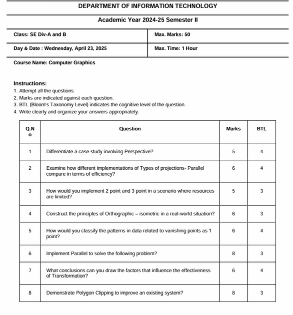

# Question Paper Generator

## Description

This project is a web-based application for generating question papers. Users can input a syllabus, specify parameters like difficulty, number of questions, and question style, and the application will generate a question paper. The generated paper can then be saved as a PDF or exported to Excel. Questions are stored in and retrieved from a MySQL database.

## Features

- Generate questions based on syllabus, difficulty, number, and style.
- Save generated question papers as PDF.
- Export question papers to Excel.
- Store and manage questions in a MySQL database.
- Web-based interface for ease of use.
- API for programmatic access to question generation and storage.

## Technologies Used

- **Backend:** Flask (Python)
- **Database:** MySQL
- **Frontend:** HTML, CSS, JavaScript
- **PDF Generation:** jsPDF
- **Excel Export:** xlsx

## Setup and Installation

1.  **Prerequisites:**
    *   Python 3.x
    *   pip (Python package installer)
    *   MySQL Server

2.  **Clone the repository:**
    ```bash
    git clone <repository-url>
    cd <repository-directory>
    ```

3.  **Create a virtual environment:**
    ```bash
    python -m venv venv
    ```
    Activate the virtual environment:
    *   Windows: `venv\\Scripts\\activate`
    *   macOS/Linux: `source venv/bin/activate`

4.  **Install dependencies:**
    ```bash
    pip install -r requirements.txt
    ```

5.  **Configure the MySQL database:**
    *   Ensure your MySQL server is running.
    *   Create a database (e.g., `question_paper_db`).
    *   Update the database credentials in `config.py`:
        ```python
        class Config:
            # ...
            MYSQL_HOST = 'localhost'
            MYSQL_USER = 'your_mysql_username'
            MYSQL_PASSWORD = 'your_mysql_password'
            MYSQL_DB = 'question_paper_db' # Or your chosen database name
            MYSQL_CURSORCLASS = 'DictCursor'
        ```
    *   Create the `questions` table in your database. You can use the following SQL schema:
        ```sql
        CREATE TABLE questions (
            id INT AUTO_INCREMENT PRIMARY KEY,
            syllabus TEXT,
            question TEXT NOT NULL,
            difficulty VARCHAR(50) DEFAULT 'medium',
            marks INT DEFAULT 5,
            btl INT DEFAULT 1, -- Bloom's Taxonomy Level
            created_at TIMESTAMP DEFAULT CURRENT_TIMESTAMP
        );
        ```

6.  **Run the Flask application:**
    ```bash
    python app.py
    ```
    The application will be accessible at `http://127.0.0.1:5000/`.

## Usage

1.  Open your web browser and navigate to `http://127.0.0.1:5000/`.
2.  Enter the syllabus content in the text area.
3.  Set the desired parameters for question generation:
    *   **Difficulty Level:** Easy, Medium, Hard
    *   **Number of Questions:** Specify the count.
    *   **Question Style:** Conceptual, Application, Critical Thinking, Mixed
4.  Fill in the "Paper Details" section (Class, Max Time, Course Name, Department). These will be used in the PDF/Excel export.
5.  Click the "Generate Questions" button.
6.  The generated questions will appear in a table. You can:
    *   Edit the questions, marks, and BTL directly in the table.
    *   Add new rows or delete selected rows.
    *   Save the questions to the database by clicking "Save to Database".
7.  Export the question paper:
    *   Click "Save as PDF" to download a PDF version.
    *   Click "Export to Excel" to download an Excel spreadsheet.

## Database Schema

The primary table used is `questions`:

*   `id`: INT (Primary Key, Auto Increment) - Unique identifier for each question.
*   `syllabus`: TEXT - The syllabus content related to the question (can be general or specific).
*   `question`: TEXT (NOT NULL) - The text of the question.
*   `difficulty`: VARCHAR(50) - Difficulty level (e.g., 'easy', 'medium', 'hard').
*   `marks`: INT - Marks allocated to the question.
*   `btl`: INT - Bloom's Taxonomy Level for the question.
*   `created_at`: TIMESTAMP - Timestamp of when the question was added.

## API Endpoints

The application provides the following API endpoints:

*   `GET /`: Serves the main HTML page.
*   `POST /api/generate_questions`:
    *   Generates questions based on the provided syllabus, difficulty, number of questions, and question style.
    *   Request Body (JSON): `{ "syllabus": "...", "difficulty": "...", "num_questions": ..., "question_style": "..." }`
    *   Response (JSON): Array of generated question objects.
*   `POST /api/save_question`:
    *   Saves a single question to the database.
    *   Request Body (JSON): `{ "syllabus": "...", "question": "...", "difficulty": "...", "marks": ..., "btl": ... }`
    *   Response (JSON): `{ "success": true/false, "message": "..." }`
*   `POST /api/save_questions`:
    *   Saves a list of questions to the database.
    *   Request Body (JSON): `{ "syllabus": "...", "questions": [{...}, {...}] }` (questions is an array of question objects)
    *   Response (JSON): `{ "success": true/false, "message": "..." }`
*   `GET /api/get_questions`:
    *   Retrieves questions from the database.
    *   Query Parameters: `difficulty` (e.g., 'medium'), `limit` (e.g., 20)
    *   Response (JSON): Array of question objects.

## Sample of generated question paper


## Contributing

Contributions are welcome! Please follow these steps:

1.  Fork the repository.
2.  Create a new branch (`git checkout -b feature/your-feature-name`).
3.  Make your changes.
4.  Commit your changes (`git commit -m 'Add some feature'`).
5.  Push to the branch (`git push origin feature/your-feature-name`).
6.  Open a Pull Request.

Please ensure your code follows existing style and that any new features are well-tested.
